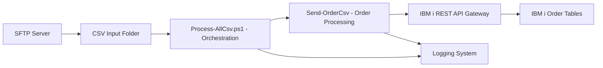
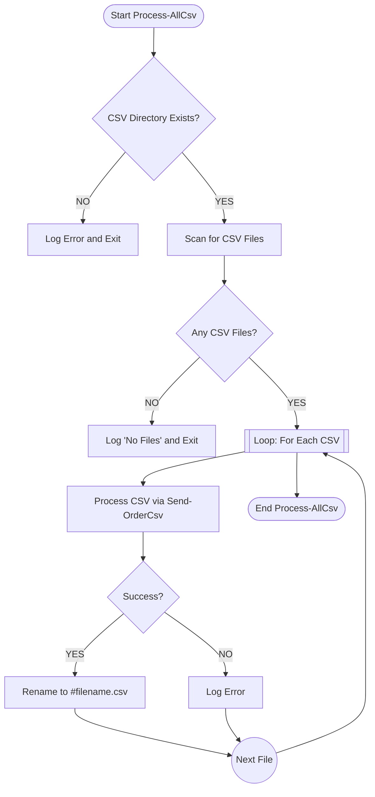
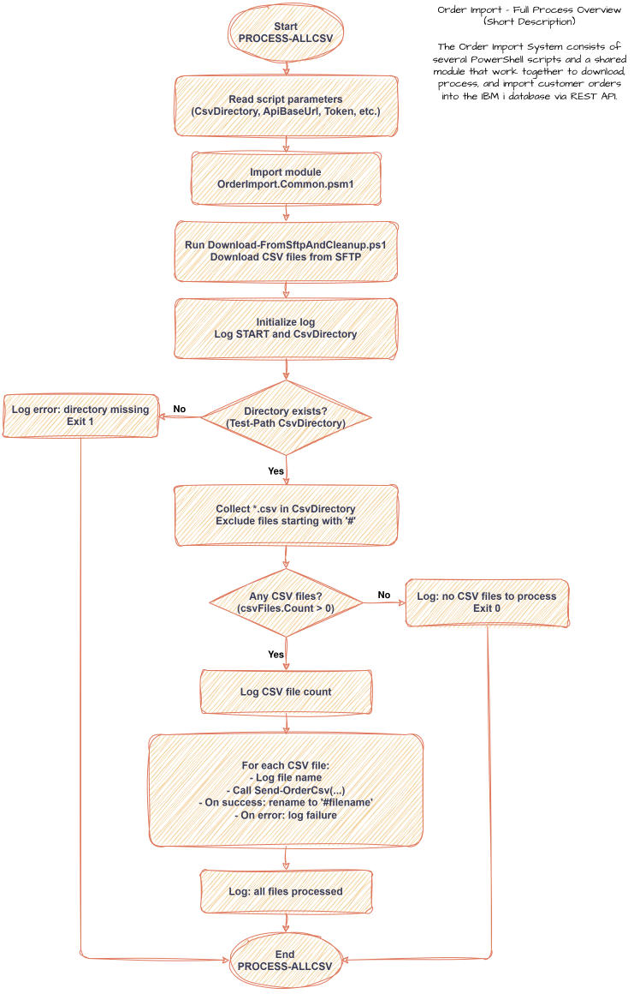

# Ordering – Automated Order Import Pipeline for IBM i


A fully automated, production-ready **Order Import Pipeline** designed for IBM i (AS/400) environments.  
It downloads CSV files from SFTP, validates them, transforms them into structured orders, and imports them using REST APIs.

This repository contains:

- PowerShell automation pipeline  
- IBM i REST API integration  
- Logging & error handling  
- SFTP management  
- Documentation & diagrams  

---

# 📊 Full Order Import Pipeline – High-Level Flow



---

# 📊 Top-Level Logic (Simplified Processing Flow)



---

# 📁 Project Structure

```
ordering/
├── Process-AllCsv.ps1                # Main orchestration script
├── Download-FromSftpAndCleanup.ps1   # SFTP download & cleanup
├── OrderImport.Common.psm1           # Shared module (API utilities, logging)
├── Send-OrderCsv.ps1                 # Core CSV order-processing pipeline
│
├── diagrams/
│   └── order_import_flow.svg         # Full architecture diagram
│
└── docs/
    └── Process_Description.docx      # Full documentation
```

---

# 🧱 Architecture Overview (Detailed)

## 1. Main Script – Process-AllCsv.ps1

The orchestrator responsible for:

### **1.1 Parameter Initialization**
Loads all runtime configuration:

- CsvDirectory  
- ApiBaseUrl  
- BearerToken  
- UserInterface  
- ChannelId  
- LogPath  
- RequestDumpDirectory  
- TestMode / DryRun

### **1.2 SFTP Download & Cleanup**
Executes:

```
Download-FromSftpAndCleanup.ps1
```

Performs:

- Download CSV files from SFTP  
- Delete remote files after successful download  

### **1.3 Logging Initialization**
Creates a log file and writes session start information.

### **1.4 Directory Validation**
Exits cleanly if directory does not exist.

### **1.5 CSV File Collection**
Finds all `.csv` files except those prefixed with `#` (already processed).

### **1.6 Processing Loop**
For each CSV file:

- Log file header  
- Call `Send-OrderCsv`  
- On success → rename to `#filename.csv`  
- On failure → log errors and keep file  

### **1.7 Completion**
Writes:

```
ALL FILES PROCESSED
```

---

## 2. Core Processor – Send-OrderCsv.ps1

Handles the transformation of CSV data into valid IBM i order structures.

### **2.1 Validation & Import**
- Ensures file exists  
- Imports semicolon-separated rows  
- Validates content  

### **2.2 API Initialization**
Prepares:

- Add URL  
- Update URL  
- Select URL  
- HTTP headers  
- Bearer token  

### **2.3 Grouping**
Rows grouped by `order_unique_id`  
→ Each group becomes one order.

### **2.4 Per-Order Lifecycle**

#### **Existence Check**
Executes a SELECT query.  
If order already exists → skip.

#### **Header Insert**
Creates JSON payload and POSTs to `/add`.

#### **Line Inserts**
For each order line → build JSON → POST to `/add`.  
Failures mark the order as invalid.

#### **Status Updates**
Only if:
- Header inserted  
- All lines inserted  

PATCH updates to mark order as validated.

### **2.5 Completion & Error Handling**
Logs final state.  
If errors occurred → throws exception.

---

# 🚀 Developer Quickstart

## Clone Repository

```sh
git clone https://github.com/<user>/ordering.git
cd ordering
```

## Run Import Pipeline

```powershell
.\Process-AllCsv.ps1 `
   -CsvDirectory "D:\Wagner\incoming" `
   -ApiBaseUrl "https://api.example.com" `
   -BearerToken "<token>" `
   -LogPath "D:\Wagner\logs" `
   -RequestDumpDirectory "D:\Wagner\requests" `
   -TestMode:$false
```

---

# ⚙️ Configuration Reference

| Parameter | Description |
|----------|-------------|
| `CsvDirectory` | Directory containing CSV files |
| `ApiBaseUrl` | IBM i API base URL |
| `BearerToken` | Authentication token |
| `UserInterface` | Optional UI/channel metadata |
| `ChannelId` | Optional channel reference |
| `LogPath` | Folder for log files |
| `RequestDumpDirectory` | Directory for request/response dumps |
| `TestMode` / `DryRun` | No-write mode for testing |

---

# 📝 Logging & Error Handling

### The pipeline logs:

- Startup information  
- Directory status  
- File discovery  
- Per-file processing  
- API request results  
- Per-order states  
- Final summary  

### Error Scenarios:

- Missing directory → immediate exit  
- Missing file → exception inside Send-OrderCsv  
- CSV empty → validation error  
- API failure → logged & flagged as order failure  
- Failed orders → do NOT rename file  

---

# 📘 Documentation

Full process description:

```
docs/Process_Description.docx
```

# 🧭 Architecture Diagram



---

# 🤝 Contributing

We welcome contributions!

- Fork repository  
- Create feature branch  
- Commit changes  
- Open pull request  

---

# ⭐ Support

If this project helps you, please ⭐ star the repository to support development.

