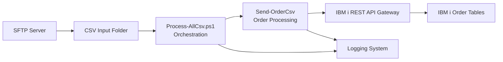

# Ordering – Automated Order Import Pipeline for IBM i


A fully automated, production-ready **Order Import Pipeline** designed for IBM i (AS/400) environments.  
It downloads CSV files from SFTP, processes and validates them, transforms them into structured orders, and imports them using REST APIs.

This repository contains:

- PowerShell automation pipeline  
- IBM i REST API integration  
- Logging & error handling  
- SFTP management  
- Documentation & diagrams  

---

# 📊 Full Order Import Pipeline – High-Level Flow




# 📊 Top-Level-Logik


---

# 📁 Project Structure

```
ordering/
├── Process-AllCsv.ps1
├── Download-FromSftpAndCleanup.ps1
├── OrderImport.Common.psm1
├── Send-OrderCsv.ps1
├── diagrams/
│   └── order_import_flow.svg
└── docs/
    └── Process_Description.docx
```

---

# 🧱 Architecture Overview

## Main Script – Process-AllCsv.ps1

Handles parameter loading, SFTP download, logging, file discovery, and calling **Send-OrderCsv**.

## Core Processor – Send-OrderCsv

Validates CSV, groups by order, checks IBM i existence, inserts header + line items, updates statuses.

---

# 🚀 Developer Quickstart

```sh
git clone https://github.com/<user>/ordering.git
```

```powershell
.\Process-AllCsv.ps1 -CsvDirectory "D:\Wagner\incoming"
```

---

# 📘 Documentation

Located in:

```
docs/Process_Description.docx
```

---

# 🤝 Contributing

See `CONTRIBUTING.md`.

---

# ⭐ Support

Star the repository if this project helps you!
